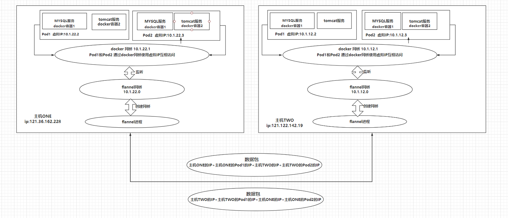

基本组成
------------------------------------------
- pod：k8s 最小单位，类似docker的容器（也许）
- 资源清单：资源、资源清单语法、pod生命周期
- 调度器：将容器分配到对应pod的功能组件（描述应该没错吧）
- 服务发现：通过暴露地址和端口，让客户端访问
- 存储组成：
  1. configMap:配置文件
  2. secret：安全相关
  3. volume：数据
- 安全体系：集群认证、体系、访问控制
- HELM ：貌似包含了一些集群一键部署的命令
- 证书：k8s许可只有一年

K8S结构:
----------------------------------
- master：
  1. 调度器（schduler--**api server**--etcd）：控制任务
  2. replication controller:控制副本数量
  3. 客户端kubectl、brower
- Pod：kublet、kubproxy、docker（或其他容器）
- ETCD:分布式键值数据库
	内存 v2版本,
	硬盘 v3版本
 - PV动态创建
 - 备份机制

重要组件
---------------------------------------

- APISERVER :所有程序访问的统一入口
- ControllerManager：维持副本期望数目
- Scheduler：负责介绍任务，选择合适节点进行任务分配
- ETCD:键值对数据库 存储k8s集群所有的重要信息
- Kublet： 直接跟容器引擎交互实现容器的生命周期管理
- Kube-proxy：负责把规则写入IPABLES、IPVS实现服务映射访问的
- CORENDS:为集群中的SVC 创建一个域名IP的对应关系解析
- DASHBOARD: 给K8S集群提供一个 B/S 结构访问体系
- INGRESS CONTROLLER（第三方）: INGRESS 实现7层代理
- FEDERATION: 提供一个可以跨集群中心多K8S统一管理功能
- PROMETHEUS: 提供K8S集群的监控能力
- ELK : 提供K8S 集群日志统一分析平台

Pod
------------------------------
- POD(可以理解为):自主式POD和控制器管理的POD
	1.  POD内的端口不能有冲突
	2.  POD内网络公用、磁盘公用

控制器
-----------------------------

- ReplicationController： 保证节点数量
- ReplicaSet： **支持打标签，易于管理**
- Deployment：**支持滚动更新**

- HPA :弹性伸缩

- 无状态服务：nginx、tomcat等
- 有状态服务：mysql、mongoDB等

- StateFulset：解决有状态服务的问题
  1. 稳定持久化存储
  2. 稳定网络标志（podName和HostName）
  3. 有序部署：保证pod按照一定顺序部署
  4. 有序回收：保证pod按照一定顺序删除
- DaemonSet： 确保全部或部分node上运行一个Pod副本！
  自我理解为当新加一个node后，为该node分配一个Pod副本，
  如果当前node有Pod，则当前node上的Pod在其他node上也会分配Pod副本！
- job：处理批处理任务，可判断程序是否正常退出（类似java的事务吧？）

服务发现
----------------------
客户端通过Service的IP:port访问service上的服务。
service则通过标签及一定算法来连接Pod。

Kubernetes 网络
-------------------------------
- 特点:扁平化网络
- Pod通讯：
1. Pod内容器通过pause
2. Pod间可以通过：Overlay 网络模式
3. Pod与Service：各个node的iptables规则（防火墙协议）\ LVS

- flannel网络服务：为k8s创建一个overlay网络。
  - overlay网络：为每一个容器在集群中分配一个虚拟IP，不同节点的容器之间通过虚拟IP通信！

