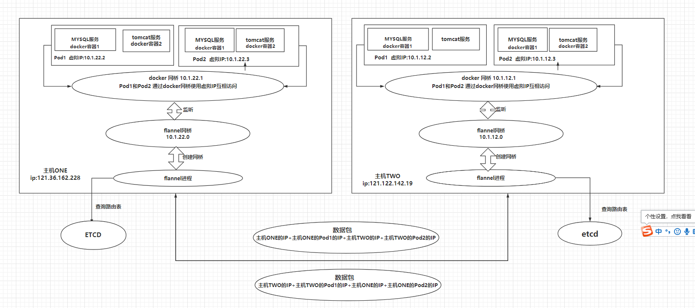

基本组成
------------------------------------------
- pod：k8s 最小单位，类似docker的容器（也许）
- 资源清单：资源、资源清单语法、pod生命周期
- 调度器：将容器分配到对应pod的功能组件（描述应该没错吧）
- 服务发现：通过暴露地址和端口，让客户端访问
- 存储组成：
  1. configMap:配置文件
  2. secret：安全相关
  3. volume：数据
- 安全体系：集群认证、体系、访问控制
- HELM ：貌似包含了一些集群一键部署的命令
- 证书：k8s许可只有一年

K8S结构:
----------------------------------
- master：
  1. 调度器（schduler--**api server**--etcd）：控制任务
  2. replication controller:控制副本数量
  3. 客户端kubectl、brower
- Pod：kublet、kubproxy、docker（或其他容器）
- ETCD:分布式键值数据库
	内存 v2版本,
	硬盘 v3版本
 - PV动态创建
 - 备份机制

重要组件
---------------------------------------

- APISERVER :所有程序访问的统一入口
- ControllerManager：维持副本期望数目
- Scheduler：负责介绍任务，选择合适节点进行任务分配
- ETCD:键值对数据库 存储k8s集群所有的重要信息
- Kublet： 直接跟容器引擎交互实现容器的生命周期管理
- Kube-proxy：负责把规则写入IPABLES、IPVS实现服务映射访问的
- CORENDS:为集群中的SVC 创建一个域名IP的对应关系解析
- DASHBOARD: 给K8S集群提供一个 B/S 结构访问体系
- INGRESS CONTROLLER（第三方）: INGRESS 实现7层代理
- FEDERATION: 提供一个可以跨集群中心多K8S统一管理功能
- PROMETHEUS: 提供K8S集群的监控能力
- ELK : 提供K8S 集群日志统一分析平台

Pod
------------------------------
- POD(可以理解为):自主式POD和控制器管理的POD
	1.  POD内的端口不能有冲突
	2.  POD内网络公用、磁盘公用

控制器
-----------------------------

- ReplicationController： 保证节点数量
- ReplicaSet： **支持打标签，易于管理**
- Deployment：**支持滚动更新**

- HPA :弹性伸缩

- 无状态服务：nginx、tomcat等等
- 有状态服务：mysql、mongoDB等等

- StateFulset：解决有状态服务的问题
  1. 稳定持久化存储
  2. 稳定网络标志（podName和HostName）
  3. 有序部署：保证pod按照一定顺序部署
  4. 有序回收：保证pod按照一定顺序删除
- DaemonSet： 确保全部或部分node上运行一个Pod副本！
  自我理解为当新加一个node后，为该node分配一个Pod副本，
  如果当前node有Pod，则当前node上的Pod在其他node上也会分配Pod副本！
- job：处理批处理任务，可判断程序是否正常退出（类似java的事务吧？）

服务发现
----------------------
客户端通过Service的IP:port访问service上的服务。
service则通过标签及一定算法来连接Pod。

Kubernetes 网络
-------------------------------
- 特点:扁平化网络
- Pod通讯：
1. Pod内容器通过pause
2. Pod间可以通过：Overlay 网络模式
3. Pod与Service：各个node的iptables规则（防火墙协议）\ LVS

- flannel网络服务：为k8s创建一个overlay网络。
  - overlay网络：为每一个容器在集群中分配一个虚拟IP，不同节点的容器之间通过虚拟IP通信！

K8S安装
----------------------------------
- 关闭防火墙：
 systemctl stop firewalld
 systemctl disable firewalld

- 关闭selinux：
  sed -i 's/enforcing/disabled/' /etc/selinux/config 
  setenforce 0

关闭swap：
  swapoff -a

- 设置主机名
hostnamectl set-hostname master
hostnamectl set-hostname k8s-node1
hostnamectl set-hostname k8s-node2

- 设置host绑定关系（这里有个坑，公网IP貌似kubeadm init时会报错【需要开相关端口】，内网IP则OK）
公网：
cat >> /etc/hosts << EOF
121.36.162.228  k8s-master
119.3.29.205    k8s-node1
121.36.131.14   k8s-node2
EOF
内网：
cat >> /etc/hosts << EOF
192.168.0.179  k8s-master
192.168.0.25    k8s-node1
192.168.0.93   k8s-node2
EOF

- 设置流量转发（官网建议）：
 	cat > /etc/sysctl.d/k8s.conf << EOF
net.bridge.bridge-nf-call-ip6tables = 1
net.bridge.bridge-nf-call-iptables = 1
EOF
    执行生效：
    sysctl --system

- 安装docker：
  配置阿里云源：
  wget https://mirrors.aliyun.com/docker-ce/linux/centos/docker-ce.repo -O /etc/yum.repos.d/docker-ce.repo
  安装docker（最好是18及以上版本，否则可能会...）：
  yum -y install docker-ce-18.06.1.ce-3.el7
  设置开机启动：
  systemctl enable docker && systemctl start docker
  检查安装：
  docker --version
  *版本18即安装成功

  (XSHELL 工具--发送输入到所有会话)
  - 安装一些依赖：
   yum install -y conntrack ntpdate ntp ipvsadm ipset jq iptables curl sysstat libseccomp wget vim net-tools git

  - 同步时间：
   ntpdate time.windows.com
  
  配置阿里云镜像加速器：
  sudo mkdir -p /etc/docker
  sudo tee /etc/docker/daemon.json <<-'EOF'
{
"registry-mirrors": ["https://vkayqpp3.mirror.aliyuncs.com"]
}
EOF
	sudo systemctl daemon-reload
	sudo systemctl restart docker

- 添加阿里云yum源
 	cat > /etc/yum.repos.d/kubernetes.repo << EOF
[kubernetes]
name=Kubernetes
baseurl=https://mirrors.aliyun.com/kubernetes/yum/repos/kubernetes-el7-x86_64
enabled=1
gpgcheck=1
repo_gpgcheck=1
gpgkey=https://mirrors.aliyun.com/kubernetes/yum/doc/yum-key.gpg https://mirrors.aliyun.com/kubernetes/yum/doc/rpm-package-key.gpg
EOF

- 安装kubeadm，kubelet和kubectl
  yum install -y kubelet-1.17.0 kubeadm-1.17.0 kubectl-1.17.0

  设置开机启动：  
  systemctl enable kubelet

  (XSHELL 工具--发送输入到所有会话  先关闭这个功能)

- 【公网】在master节点执行初始化（master地址：121.36.162.228）：
kubeadm init \
--apiserver-advertise-address=121.36.162.228 \
--image-repository registry.aliyuncs.com/google_containers \
--kubernetes-version v1.17.0 \
--service-cidr=10.1.0.0/16 \
--pod-network-cidr=10.244.0.0/16
- 【内网】
kubeadm init \
--apiserver-advertise-address=192.168.0.179 \
--image-repository registry.aliyuncs.com/google_containers \
--kubernetes-version v1.17.0 \
--service-cidr=10.1.0.0/16 \
--pod-network-cidr=10.244.0.0/16

- 复制命令，设置kubectl 连接：
mkdir -p $HOME/.kube
sudo cp -i /etc/kubernetes/admin.conf $HOME/.kube/config
sudo chown $(id -u):$(id -g) $HOME/.kube/config

--------------------------------------
以下还有点问题

- 安装网络插件：
执行：  wget:https://raw.githubusercontent.com/coreos/flannel/a70459be0084506e4ec919aa1c114638878db11b/Documentation/kube-flannel.yml
docker pull 
也可以官网安装：https://github.com/coreos/flannel

- 在其他终端复制命令，让其加入：
kubeadm join 192.168.0.179:6443 --token gytw5j.s17r2eztwxobwbs4 \
    --discovery-token-ca-cert-hash sha256:f5062698588983af4aade27f8df594dc17280ebef486d9c1419bf1006eb13d9f

- 测试一下，查看默认pod：
kubectl get pods -n kube-system

